# 🚛 Transportation and Logistics End-User Operational Manual

> [!NOTE]
> **Audience:** Fleet Managers, Dispatchers, Drivers, Field Delivery Agents, Fuel Officers, and Authorized Operations Staff  
> **System Scope:** Phase 1 & 2A Fleet/Transport Operations, Phase 3 Fuel & Readings, and MVP 1.3 Delivery Operations Foundation & Analytics (`US-56` through `US-61`)  
> **Security Baseline:** Multi-Tenant Row-Level Security, Role-Based Access Control (RBAC), and Audit Compliance  

---

## 🗺️ Visual Architecture & Bounded Contexts

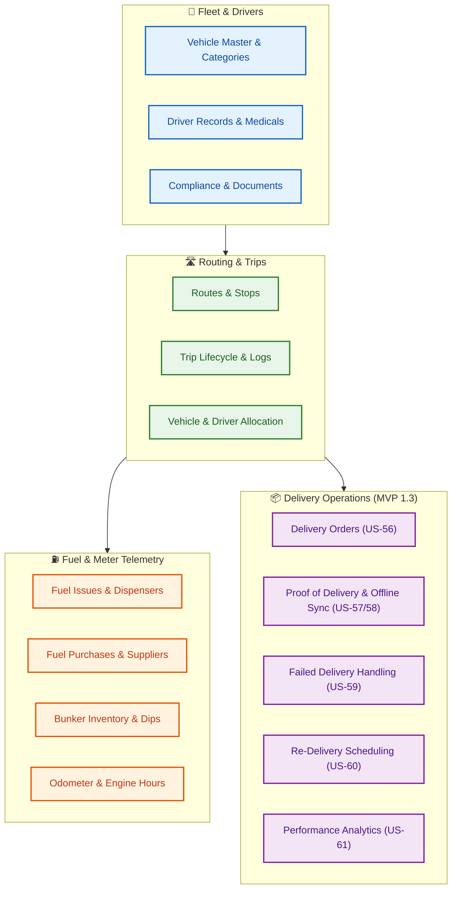

---

## 1. 🎯 Purpose and Scope

This manual explains how to complete day-to-day transportation and logistics workflows available in the system. It covers vehicle records, compliance documents, trip-based vehicle and driver allocation, route planning, driver performance, core fuel operations, and tenant-scoped delivery operations with performance analytics.

The system is strictly **permission-controlled** and **tenant-isolated**. Users only see records, actions, and menu items matching their assigned organization role.

Organization administrators with `IDENTITY_MANAGE` can administer users only in their own active organization. New users are enrolled into that organization automatically. An administrator cannot assign a role containing permissions the administrator does not currently hold, and cannot change or remove a role template that is also assigned in another organization. Cross-organization user identifiers are reported as unavailable.

### 📌 Current-Scope Rules & Invariants
- 🔒 **Vehicle Allocation:** Reserving a vehicle means assigning an eligible vehicle to a trip. There is no separate provisional hold.
- 📄 **Compliance Documents:** Recording a document captures metadata and a verified file reference or URL.
- 🗺️ **Route Optimization:** Optimization generates a preview; the proposed stop sequence is only operational when applied by an authorized dispatcher.
- ⛽ **Bunker Dip Readings:** Physical dip measurements are observational and do not change authoritative book inventory without an authorized stock adjustment.
- 📦 **Delivery Lifecycle:** Delivery orders move through strict state machine transitions (`DRAFT` ➔ `READY_FOR_ASSIGNMENT` ➔ `DELIVERED` / `FAILED_ATTEMPT` / `RETURN_TO_BASE`).
- 📊 **Delivery Analytics:** Read-only operational metrics calculated using terminal outcomes and committed customer time windows.

---

## 2. 🚀 Getting Started

### 🔑 Sign-In & Module Navigation

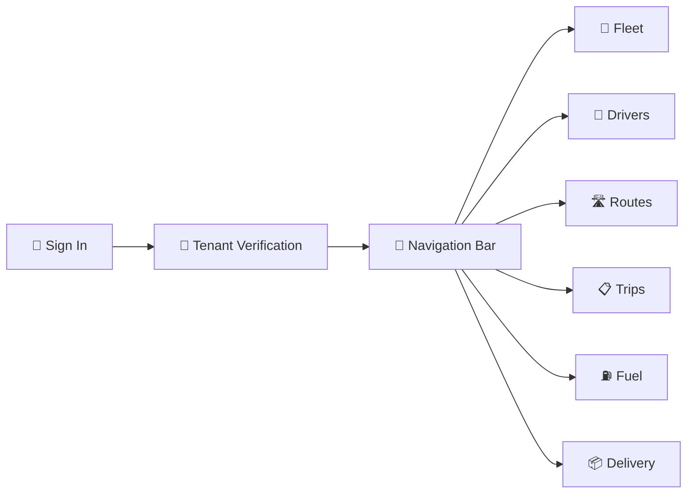

1. **Step 1:** Open the application URL and sign in with your assigned username and password.
2. **Step 2:** Confirm your active Organization / Tenant name displayed in the top right header.
3. **Step 3:** Use the left navigation sidebar to access your permitted business modules.
4. **Step 4:** If a module is missing or disabled, contact your Organization Administrator to verify role permissions.

### 💡 Common UI Behaviors & Best Practices
- 🔍 **Search Before Create:** Always search by registration number, driver code, or delivery order number before creating a new record.
- 🔴 **Validation Requirements:** All mandatory fields marked with an asterisk must be satisfied before confirmation buttons become active.
- 🏷️ **Correlation Tracing:** Keep note of displayed error Correlation IDs when contacting technical support.
- 🔄 **Concurrency Handling:** Refresh views when multiple operators are updating the same dispatch queue.

---

## 3. 🚛 Vehicle Master and Compliance Documents

**Navigation:** `Fleet` > `Vehicles` (`/fleet/vehicles`)  
**Permissions Required:** `VEHICLE_VIEW`, `VEHICLE_CREATE`, `VEHICLE_EDIT`

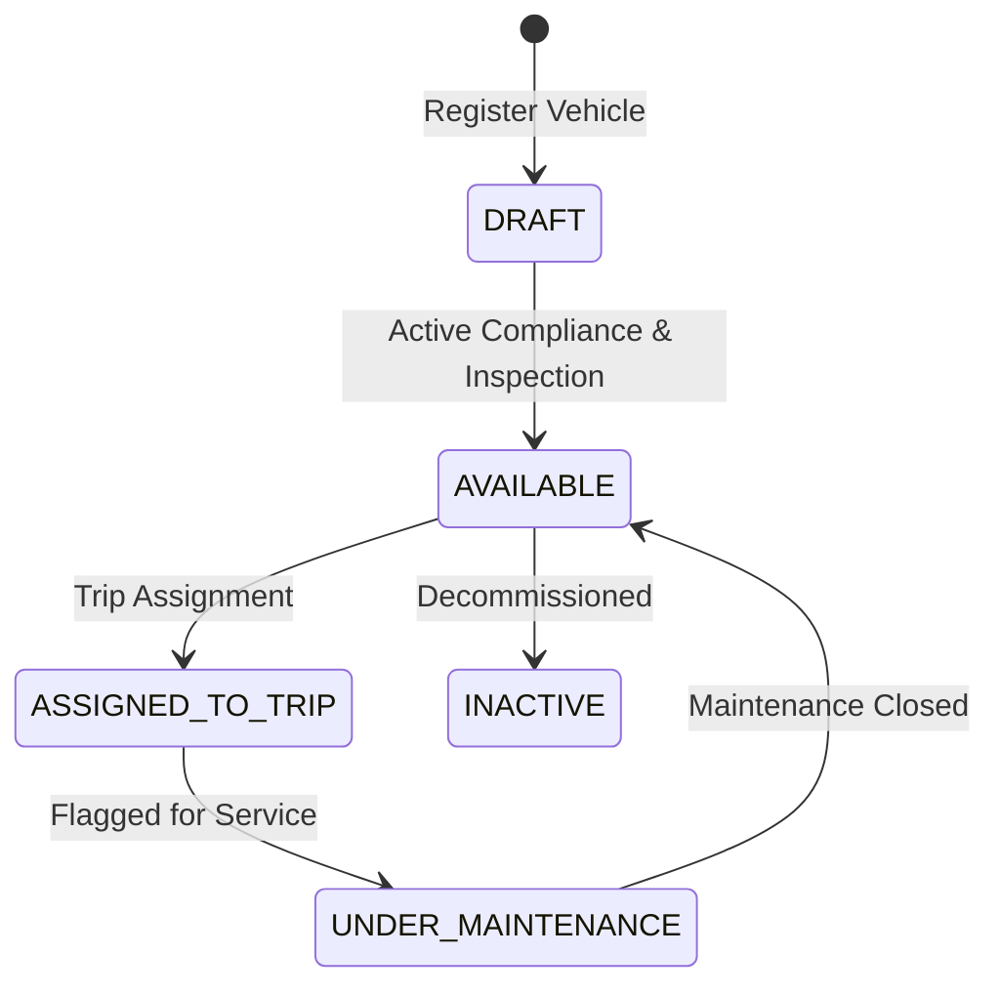

### 3.1 Register a Vehicle
1. Navigate to **Fleet > Vehicles** and click **Add Vehicle**.
2. Enter the official Registration Number (e.g., `WP-CAB-1234`), Make, Model, and Year.
3. Select Vehicle Category, Type, Ownership Classification, and Payload Capacity (kg / m³).
4. Enter the verified starting Odometer reading.
5. Set initial operational status to `Available` only if mandatory compliance documents are ready.
6. Click **Save Vehicle**.

### 3.2 Record Compliance Documents (RC, Insurance, Emission)
1. Open the vehicle record and navigate to the **Compliance Documents** tab.
2. Click **Add Document** and select document type (`RC`, `INSURANCE`, `EMISSION`, `FITNESS`).
3. Enter Document Number, Issue Date, and Expiration Date.
4. Enter the approved cloud/document file reference URL.
5. Check **Mandatory for Dispatch** for critical legal certificates.
6. Click **Save Document**.

> [!WARNING]
> **Dispatch Lockout:** Any vehicle with an expired or missing **Mandatory for Dispatch** document is automatically blocked by the system during trip assignment and dispatch authorization.

---

## 4. 🔗 Vehicle & Driver Allocation

**Navigation:** `Trips` > `Select Trip` > `Assign Vehicle / Driver` (`/trips/:id`)

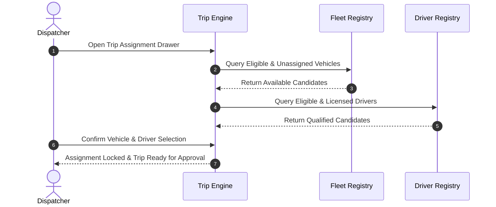

### 4.1 Check Vehicle & Driver Eligibility
1. Open the planned trip from the **Trips** dashboard.
2. Click **Assign Vehicle** to inspect real-time candidate availability.
3. Review payload and cargo volume requirements against vehicle capacity.
4. Click **Assign Driver** and verify that the driver's license class matches vehicle classification and medical records are unexpired.
5. Click **Confirm Assignment**.

---

## 5. 📋 Trip Execution & Lifecycle

**Navigation:** `Trips` (`/trips`), `New Trip` (`/trips/new`), `Trip Details` (`/trips/:id`)

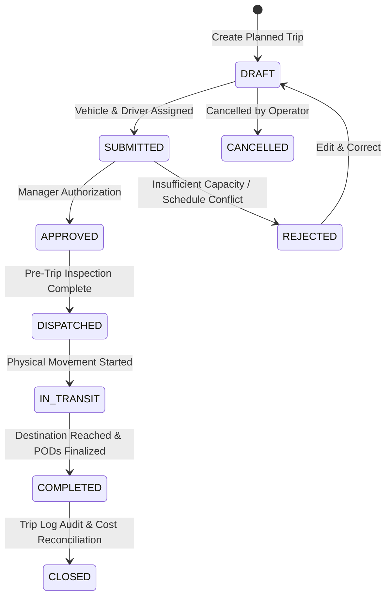

### 5.1 Step-by-Step Trip Operations
1. **Create Draft:** Enter planned route, scheduled departure, and cargo manifest.
2. **Assign Resources:** Select eligible vehicle and driver.
3. **Submit for Approval:** Click **Submit** to trigger manager review.
4. **Approve / Authorize:** Authorized supervisor verifies compliance and clicks **Approve**.
5. **Dispatch:** Dispatcher completes pre-departure checklist and clicks **Dispatch**.
6. **Maintain Logs:** Driver/Dispatcher logs intermediate checkpoints, delays, and incidents in real time.
7. **Complete & Close:** At journey termination, verify odometer readings and click **Complete**, followed by administrative **Close**.

---

## 6. 🛣️ Route Planning and Disruption Management

**Navigation:** `Routes` (`/routes`)

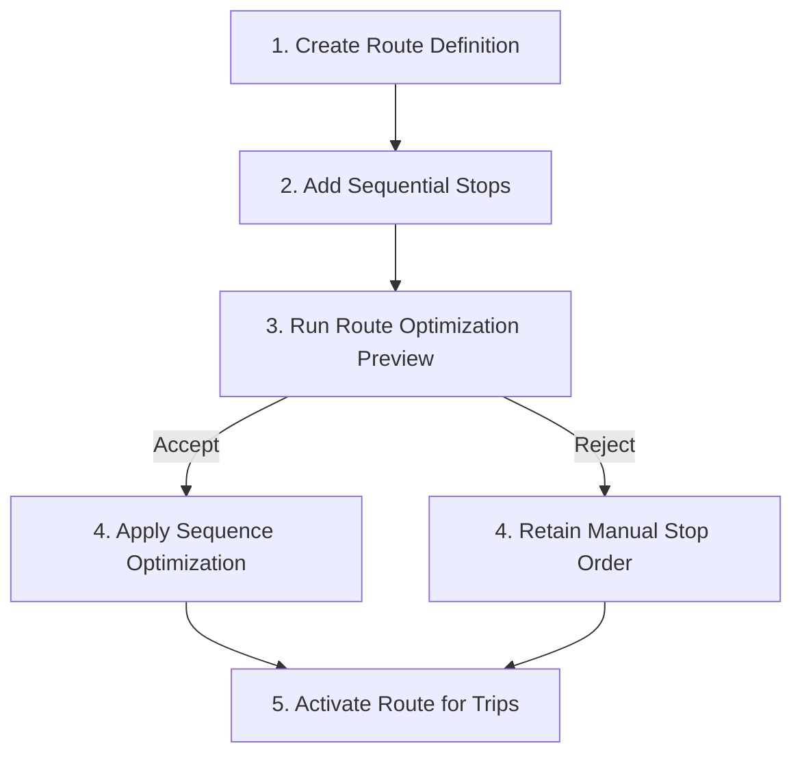

### 6.1 Manage Route Disruptions
1. Open the affected route under **Routes**.
2. Click **Report Disruption**.
3. Select Disruption Category (`ROAD_CLOSURE`, `ACCIDENT`, `WEATHER`, `TRAFFIC_CONGESTION`).
4. Select Severity level (`LOW`, `MEDIUM`, `HIGH`, `CRITICAL`) and record operational impact notes.
5. Click **Save Disruption** to broadcast operational alerts across active trips.
6. Once cleared in the field, click **Resolve Disruption** to return the route corridor to normal.

---

## 7. 👤 Driver Records, Medicals & Safety Performance

**Navigation:** `Drivers` (`/drivers`)

### 7.1 Driver Compliance Lifecycle
- 🪪 **Licence Management:** Track driving licence categories, issue dates, and expiry alerts.
- 🩺 **Medical & Fitness:** Record routine health checkups and safety clear-for-duty certifications.
- 📊 **Safety Scorecard:** Real-time driver scorecard monitoring completed trips, speed violations, and incident points.

---

## 8. ⛽ Fuel Operations & Meter Telemetry

**Navigation:** `Fuel` (`/fuel/issues`, `/fuel/purchases`, `/fuel/bunker-tanks`)

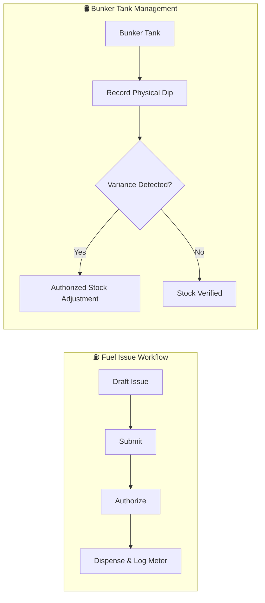

### 8.1 Dispensing Fuel & Capturing Readings
1. Open **Fuel > Fuel Issues** and click **New Fuel Issue**.
2. Select Vehicle, Station / Dispenser, Fuel Type, and Requested Quantity.
3. Enter current Odometer and Engine Hour readings.
4. Click **Submit** ➔ Supervisor clicks **Authorize** ➔ Dispensing Officer clicks **Issue**.
5. The vehicle's odometer history is atomically updated.

---

## 9. 📦 Delivery Operations & Proof of Delivery (POD)

**Navigation:** `Delivery > Delivery Orders` (`/deliveries`)

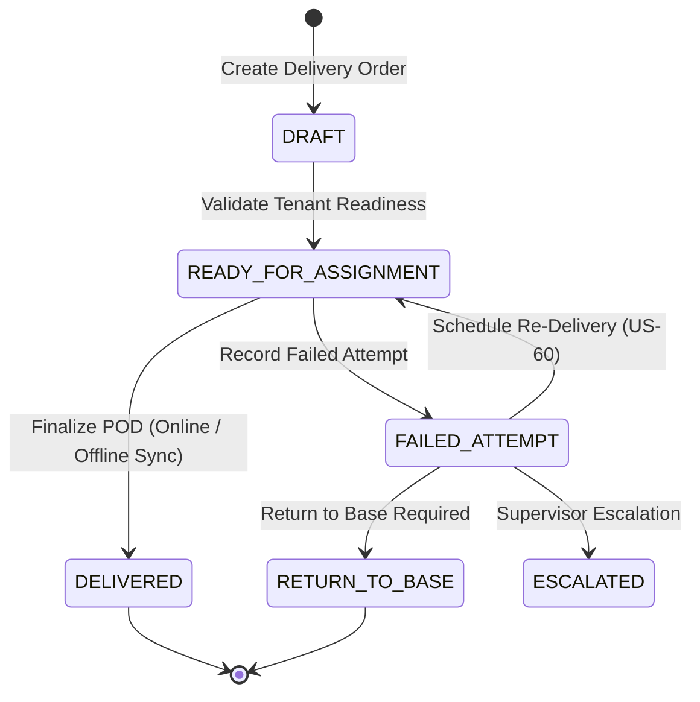

### 9.1 Create and Validate a Delivery Order (`US-56`)
1. Open **Delivery > Delivery Orders** and click **New Delivery Order**.
2. Select Customer, Origin Location, Destination Location, Priority, Service Type, and Time Window.
3. Click **Save Delivery Order** to allocate an immutable identifier (`DEL-YYYY-NNNNNN`).
4. Click **Validate Readiness**. Upon verification of active customer and distinct tenant locations, the order reaches `READY_FOR_ASSIGNMENT`.

### 9.2 Capture Proof of Delivery (`US-57` & `US-58`)
1. Open an order in `READY_FOR_ASSIGNMENT`.
2. Enter Recipient Signer Name and check mandatory **Customer Consent Confirmation** (`POD-CONSENT-V1`).
3. Attach delivery evidence:
   - ✍️ **Digital Signature:** Draw signature directly on touchscreen/canvas or upload image ($\le 2$ MB).
   - 📸 **Delivery Photos:** Capture/upload up to 3 cargo handover photos ($\le 10$ MB each).
   - 🏷️ **Barcode Scan:** Scan or input the exact `DEL-YYYY-NNNNNN` parcel barcode.
4. Finalize POD:
   - 🌐 **Online:** Click **Finalize POD Online** to immediately finalize and mark order `DELIVERED`.
   - 📴 **Offline Outbox:** Click **Save & Queue Offline** to stage in browser IndexedDB. Sync occurs automatically upon reconnection.

### 9.3 Record Failed Delivery Attempts (`US-59`)
1. When field delivery fails, open the order and navigate to **Failed Delivery Attempt**.
2. Select standard Failure Reason (`CUSTOMER_UNAVAILABLE`, `WRONG_ADDRESS`, `ACCESS_RESTRICTED`, `CUSTOMER_REFUSED`, `DAMAGED_CARGO`).
3. (Optional) Log customer contact attempts (Phone, SMS, WhatsApp, In Person).
4. Click **Record Failed Attempt** to transition the order to `FAILED_ATTEMPT`, `RETURN_TO_BASE`, or `ESCALATED`.

### 9.4 Schedule Re-Delivery (`US-60`)
1. Open a `FAILED_ATTEMPT` order eligible for redelivery.
2. Click **Schedule Re-Delivery**.
3. Choose a scheduling mode:
   - 🌅 **Automatic Depot Slots:** Next-day Morning (`09:00–13:00`) or Afternoon (`14:00–18:00`) slots verified for capacity ($\le 50$ orders/depot).
   - 🕒 **Customer Preferred Window:** Enter customer requested timeframe and verify against depot operating hours (`08:00–20:00`).
   - 🗓️ **Custom Date Range:** Select date within the 30-day scheduling horizon.
4. Click **Confirm & Schedule**. The order resets to `READY_FOR_ASSIGNMENT` with the new committed delivery window.

### 9.5 Use the Last-Mile Planner (`US-68`)

**Permissions Required:** `DELIVERY_FAIL_VIEW` or `DELIVERY_EXCEPTION_VIEW`

1. Open a Delivery Order details page and review the **Last-Mile Planner** section.
2. Use its failed-attempt, active-exception, and open-escalation counts to classify the current field situation.
3. Select the suggested action to navigate to the existing owning workflow, such as recording an actual failed attempt, reviewing a specialized exception, reassigning a Rider, reviewing Batch context, recalculating ETA, escalating, or scheduling redelivery when eligible.
4. Complete the action in that owning workflow with its own required permission and validation rules.

The Planner is read-only: opening it or selecting a navigation action does not itself change Delivery status, create an exception, schedule redelivery, assign a Rider, mutate a Batch, or calculate ETA. Do not enter raw gate/door codes, PINs, OTPs, credentials, copied contact details, or live-location data. Cross-tenant Delivery IDs remain inaccessible.

### 9.6 Review Delivery Customer Notifications (`US-69`)

**Permissions Required:** `NOTIFICATION_RULE_VIEW` to view the timeline and effective preferences; `NOTIFICATION_RULE_MANAGE` to replace a preference profile through the API.

1. Open a Delivery Order details page and locate **Customer notification timeline**.
2. Review the event/template label, Email or SMS channel, current status, masked destination, created/sent time, attempt count, and safe failure category.
3. Treat `SENT` as provider/local-adapter acceptance; it is not proof that the recipient's device displayed the message.

Notifications are generated from committed out-for-delivery, ETA-risk, completion, failed-attempt, and redelivery facts. With no explicit preference profile, a valid customer Email address is enabled and SMS is disabled. SMS is used only after explicit enablement. Preference changes affect future events; an already accepted notification keeps its normalized destination snapshot for deterministic retry.

An out-for-delivery notice is generated only after the Batch is successfully dispatched as `DISPATCHED`. Moving a Batch to `READY` produces no customer notice. Only active Batch member orders receive one notice each; removed members receive none. This behavior and the complete US-69 notification workflow have passed final acceptance.

The timeline is read-only and exposes masked destinations only. It provides no send, resend, retry, provider, or message-body action. Do not place OTPs, access/gate codes, credentials, free-text failure notes, Rider private data, or other secrets in notification workflows. US-69 itself adds no customer account/login, push, WhatsApp, voice, callback, or manual resend. The separate US-70 customer self-service magic-link workflow is described below.

### 9.7 Use Customer Self-Service (`US-70`)

**Availability:** Implemented and accepted for MVP 1.4. The milestone is 8/8 complete and closed.

**Navigation:** Open the HTTPS magic link from an operational Delivery Email or SMS. It opens the public `/track` page; no customer username, password, operator account, or OTP is required.

1. Open the link on the intended device. The page consumes the opaque token from the URL fragment, removes the fragment immediately, and keeps access only in browser memory.
2. Review the customer-safe delivery number, friendly status, destination display name, scheduled window/time zone, ETA/freshness, POD availability/completion state, current masked Email/SMS preferences, and actions currently allowed by the link.
3. Use **Notification preferences** to replace the Email/SMS operational preference profile when the token allows that action. Backend validation remains authoritative and changes apply to future notification events.
4. Use **Report an issue** to select an allow-listed category and enter a 10–1,000 character description.
5. After delivery, use **Send feedback** to submit a 1–5 rating and optional comment. One non-superseded feedback submission is retained per Delivery and Customer.
6. Use **Request delivery preference / redelivery** to submit a preferred window and optional note. This is a non-binding request for operator review: it does not reschedule the order, reserve a slot, consume capacity, or change Delivery status.

Each write uses a generated idempotency key so a network retry does not create a duplicate. Reloading the page intentionally loses in-memory access; reopen the original message link while it remains valid. Invalid, expired, revoked, contact-mismatched, action-denied, and cross-Tenant tokens all show the same safe unavailable experience.

The link is scoped to one Delivery/Customer/contact and expires after 30 days unless revoked earlier. It never exposes the full address, Rider identity/contact/location, internal IDs, operator shell, Notification body/history/provider diagnostics, exact POD evidence, slot/zone/batch internals, or ETA implementation details. Customers cannot directly cancel, schedule, book a slot, mutate an address/payment, or access offline/native-app behavior through this portal.

---

## 10. 📊 Delivery Performance Analytics (`US-61`)

**Navigation:** `Delivery > Delivery Analytics` (`/deliveries/analytics`)  
**Permissions Required:** `DELIVERY_ANALYTICS_VIEW` (Seeded for Admin, Dispatcher, Delivery Manager, Viewer)

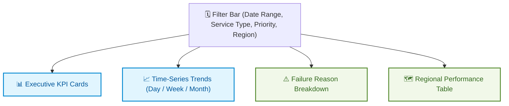

### 10.1 Executive KPI Metrics
- 🏆 **Order Success Rate (%):** $\frac{\text{Delivered Orders}}{\text{Terminal Completed (Delivered + Return to Base)}} \times 100$.
- ⏱️ **On-Time Delivery Rate (%):** Percentage of delivered orders where actual POD timestamp $\le$ committed delivery window end.
- 🎯 **First-Attempt Success Rate (%):** Orders delivered without any previous failed attempt records.
- 🔄 **Redelivery Rate (%):** Percentage of orders requiring one or more re-attempt schedules.

### 10.2 Regional & Failure Diagnostics
- 🗺️ **Regional Breakdown:** Aggregate total orders, punctuality rates, and average delay minutes grouped by destination depot/hub.
- ⚠️ **Failure Pareto Table:** Detailed share of failure causes (`Customer Unavailable`, `Wrong Address`, `Access Restricted`) and supervisor disposition metrics.
- 📈 **Time-Series Analysis:** Toggle between **Daily**, **Weekly**, and **Monthly** trend bucketing to monitor operational improvement.

---

## 11. 🚲 Delivery Rider & Shift Management (US-65)

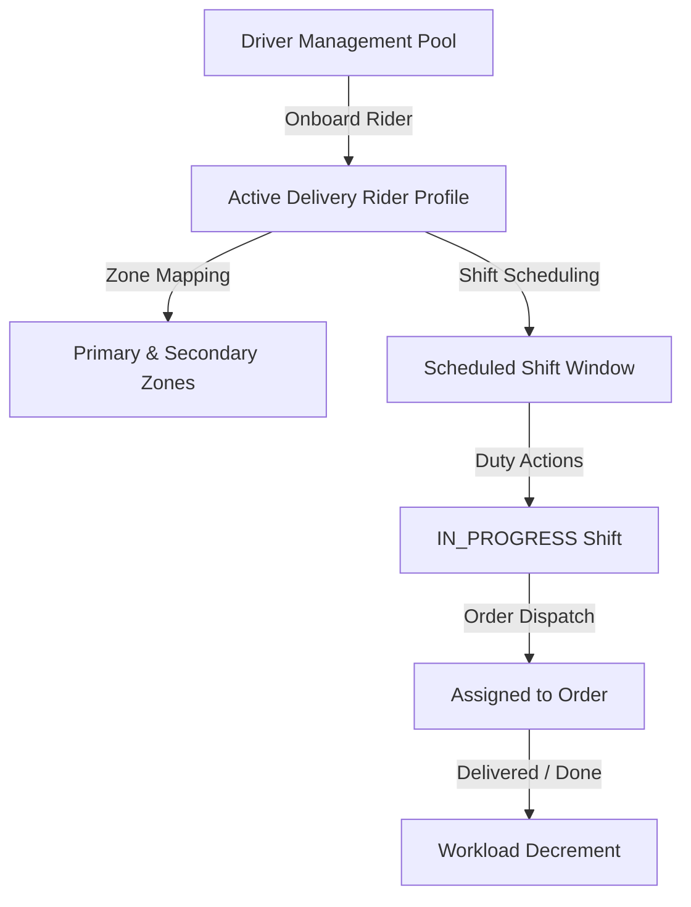

### 11.1 Onboarding & Eligibility
- **Driver Bridge:** Riders are onboarded from active, compliant Fleet Drivers.
- **Zone Alignment:** Each rider has one mandatory Primary Zone and optional Secondary Zones.
- **Capacity Limits:** `maxConcurrentDeliveries` caps parallel active assignments (default: 3).

### 11.2 Shift Operations
- **Scheduling:** Dispatchers define operational shift windows with specific dates and order capacities.
- **Duty Actions:** Riders start duty (`IN_PROGRESS`), execute deliveries, and end duty upon shift completion.

### 11.3 Assignment & Overrides
- **Zone Matching:** Destination zone must align with rider's primary or secondary zones.
- **Manager Overrides:** Dispatchers with `DELIVERY_RIDER_OVERRIDE` may assign across zones or exceed capacity limits with a mandatory justification note.

---

## 12. 📋 Daily Operational Checklists

```mermaid
flowchart TD
    subgraph FleetMgr["🚛 Fleet Manager"]
        F1["Review Expiring Documents"] --> F2["Inspect Unavailable Vehicles"]
        F2 --> F3["Audit Mileage & Meter Resets"]
    end

    subgraph Disp["📡 Dispatcher"]
        D1["Review Today's Planned Trips"] --> D2["Verify Resource Allocation"]
        D2 --> D3["Authorize Dispatches & Monitor Delays"]
    end

    subgraph Driver["🚚 Delivery Driver / Agent"]
        DR1["Verify Route & Manifest"] --> DR2["Capture Real-Time PODs"]
        DR2 --> DR3["Log Delays & Attempt Issues"]
    end

    subgraph FuelOff["⛽ Fuel Officer"]
        FO1["Verify Dispense Authorizations"] --> FO2["Log Meter Readings"]
        FO2 --> FO3["Reconcile Bunker Dip Variances"]
    end
```

---

## 12. 🛠️ Troubleshooting & Support Escalation

| Error / Condition | Root Cause | Operator Action |
| :--- | :--- | :--- |
| **`VEHICLE_COMPLIANCE_BLOCKED`** | Mandatory document expired or missing | Open vehicle compliance tab and record renewed certificate before dispatch. |
| **`DRIVER_MEDICAL_EXPIRED`** | Driver medical checkup overdue | Schedule safety examination and update medical record. |
| **`POD_CONSENT_REQUIRED`** | Customer consent checkbox unchecked | Check customer consent box prior to signature or photo capture. |
| **`DELIVERY_SLOT_CAPACITY_EXCEEDED`** | Depot reached 50 concurrent orders | Select alternative suggested morning/afternoon time window. |
| **`ANALYTICS_RANGE_EXCEEDED`** | Date range exceeds 365 days | Adjust date filter to within 365 days. |

---

## 13. 📑 Scope Boundaries

This operational manual documents active features in **Phase 1, Phase 2A, Phase 3 Core Fuel, and MVP 1.3 Delivery Operations**. Features flagged on the project roadmap as deferred (e.g., dynamic multi-echelon routing, IoT telematics, mobile native apps) are outside current system scope.
